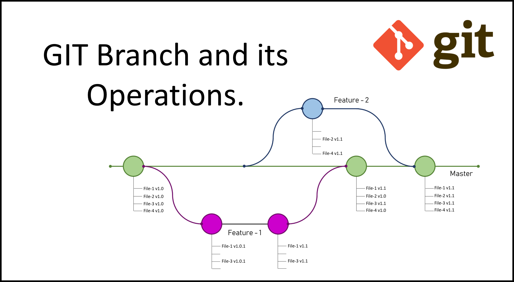

[< К содержанию](./readme.md)

## Git branch

**Git branch** - эта команда в системе контроля версий *Git* используется для управления ветками в репозитории. Ветка в *Git* — это указатель на конкретный коммит в истории изменений, у каждой ветки есть своё уникальное название. Основная ветка (обычно называется master) создаётся при установке репозитория, остальные ветки можно называть по своему усмотрению. 

